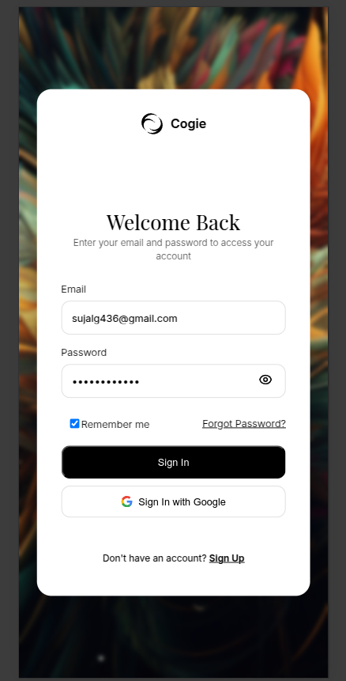

A modern, responsive sign-in page built with **React**, featuring: -
Clean UI - Background image support - Form validation - Password hashing
(SHA-256) - LocalStorage persistence - Mobile‑friendly layout

------------------------------------------------------------------------

## 🚀 How to Clone the Repository

``` bash
git clone https://github.com/Sudheer104/sign-up.git
```

Then navigate into the project folder:

``` bash
cd sign-up
```

------------------------------------------------------------------------

## 📦 Install Dependencies

Make sure you have **Node.js** installed (v16+ recommended).

Then install:

``` bash
npm install
```

Or using yarn:

``` bash
yarn
```

------------------------------------------------------------------------

## ▶️ Run the Project

``` bash
npm run dev
```

This starts the development server (usually: http://localhost:5173).

------------------------------------------------------------------------

## 🛠 Build for Production

``` bash
npm run build
```

To preview the production build:

``` bash
npm run preview
```

------------------------------------------------------------------------
## UI Preview
 
 
------------------------------------------------------------------------


## 🧱 Project Structure

    src/
     ├── App.jsx
     ├── App.css
     ├── assets/
     │    ├── bgimage1.jpg
     │    ├── bgimage2.jpg
     │    └── google.svg
     ├── main.jsx

------------------------------------------------------------------------

## 🔐 Features Included

-   Email + password validation\
-   Remember me support\
-   LocalStorage persistence\
-   Accessible labels, inputs\
-   Mobile responsive UI\
-   Background images and gradient overlay\

------------------------------------------------------------------------
